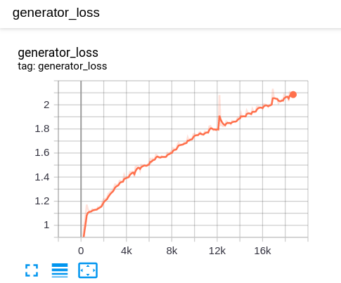
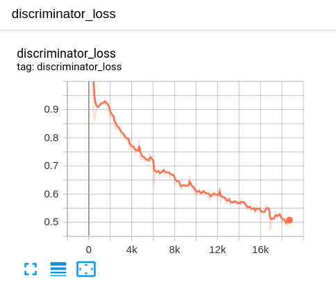
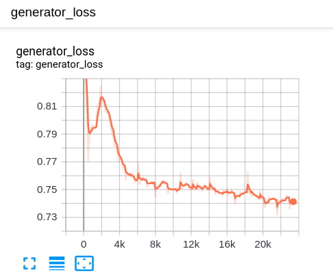
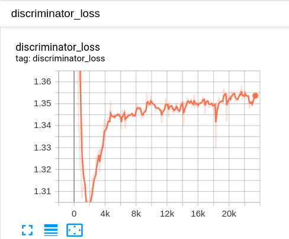

# DCGAN-MNIST
Try to use Deep Convolutional Generative Adversrial Network(DCGAN) to generate images of hand written digits


## train logs
### dropout=0
```shell script
dropout_rate = 0.0
generator_learning_rate = 2e-4
discriminator_learning_rate = 2e-4
epoch = 40
```

 |  |
|:-------------------------:|:-------------------------:|
Displayed generator Loss on Tensorboard | Displayed discriminator Loss on Tensorboard | 

 |
|:-------------------------:|
every epoch generator result of training | 

### dropout=0.5
```shell script
dropout_rate = 0.5
generator_learning_rate = 1e-4
discriminator_learning_rate = 4e-4
epoch = 50
```

 |  |
|:-------------------------:|:-------------------------:|
Displayed generator Loss on Tensorboard | Displayed discriminator Loss on Tensorboard | 

 |
|:-------------------------:|
every epoch generator result of training | 