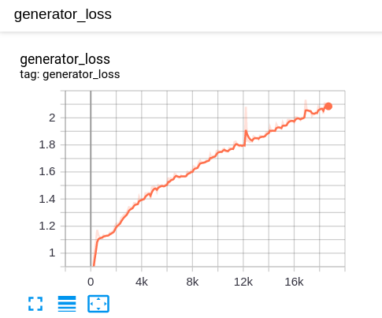
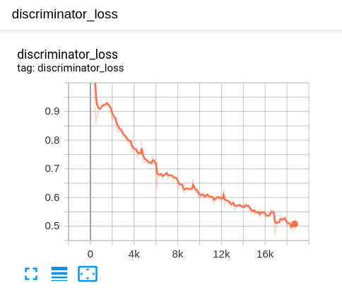

# DCGAN-MNIST
Try to use Deep Convolutional Generative Adversrial Network(DCGAN) to generate images of hand written digits

## train logs

 |  |
|:-------------------------:|:-------------------------:|
Displayed generator Loss on Tensorboard | Displayed discriminator Loss on Tensorboard | 

 |
|:-------------------------:|
Displayed one-state Loss on Tensorboard | 